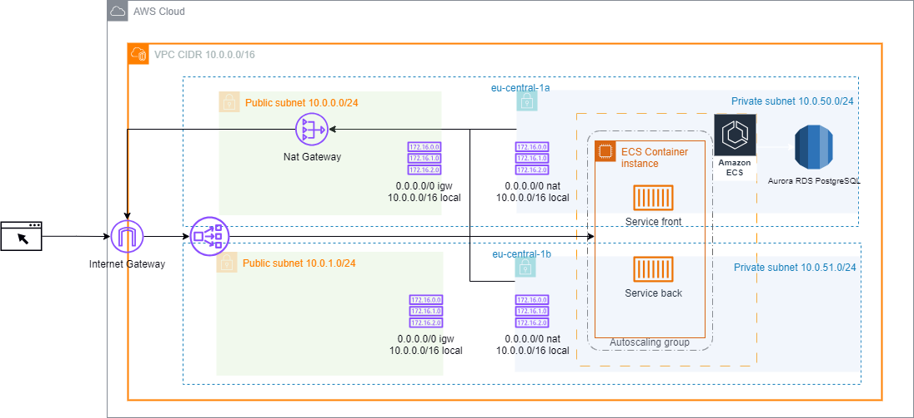

# Terraform vortexwest AWS ECS 

Terraform modules for creating a demo ECS Cluster, networking and realed resources in AWS.

## Usage:

* To create environment cd to one of the directories found in envs directory, either dev, prod or stage.
* Initialize working directory fro example here envs/dev/, with terraform init
* Concept is made with fixture **ecs.tfvars** in each of those directories, where inital parameters are defined, changing these parameters you are influencing how resources are named and created.
* We must define working directory and **ecs.tfvars** fixtures to run plan before applying changes with command terraform plan -input=false -var-file="ecs.tfvars" (if asked specify -chdir and include absolute path e.g. -chdir=Projects/tf/ens/dev)
* Export profile as varibale or create aws-cli profile for the account to create resources in, in **ecs.tfvars**, using `aws_profile`.
* Specify environemnt and AWS region to create resources into, in **ecs.tfvars**, using `aws_region` variable.
* Specify the AMI to build your ECS instance from, in **ecs.tfvars**, using `aws_ecs_ami` variable. Check here: https://docs.aws.amazon.com/AmazonECS/latest/developerguide/ecs-optimized_AMI.html
* Find the latest recommended Amazon Linux 2 or Amazon Linux 2023 ECS-optimized AMI for current region, or use of the provided options in **ecs.tfvars** using `container_instance_ami` variable:
* Specify VPC CIDR block in **ecs.tfvars**, using `vpc_cidr` variable.
* For high availability and as a mandatory option, alwas set list of two CIDRs for public subnets in **ecs.tfvars**, using `public_subnet_cidrs` variable.
* Set a list of two CIDRs for private subnets in **ecs.tfvars**, using `private_subnet_cidrs` variable.
* Set a list of two availability zones to cover all provisioned subnets in **ecs.tfvars**, using `availability_zones` variable.
* Define maximum number of allowed container instances in **ecs.tfvars**, using `max_size` variable.
* Define minimum number of allowed container instances in **ecs.tfvars**, using `min_size` variable.
* Define desired number of container instances in **ecs.tfvars**, using `desired_capacity` variable.
* Set container instance type for hosting ECS service in **ecs.tfvars**, using `instance_type` variable.
* Define frontend service name in **ecs.tfvars**, using `service_name_frontend` variable.
* Define frontend service name in **ecs.tfvars**, using `service_name_backend` variable.
* vCPU allocation for services is set in **ecs.tfvars**, using `cpu` variable.
* Memory allocation for services is set in **ecs.tfvars**, using `cpu` variable.
* To set desired number of running service tasks set in **ecs.tfvars**, using `desired_task` variable.
* Frontend service exposed container port can be set in **ecs.tfvars**, using `container_port_frontend` variable.
* Frontend service exposed container port can be set in **ecs.tfvars**, using `container_port_backend` variable.
* Type of the database hosting instance is set in **ecs.tfvars**, using `db_instance_class` variable.
* Set database port in **ecs.tfvars**, using `db_port` variable.
* Database engine is set in **ecs.tfvars**, using `db_engine` variable and database engine version in **ecs.tfvars**, using `db_engine_version` variable.
* If you want to provision replica reader in Aurora RDS cluster, set in **ecs.tfvars**, using `multi_az` variable
* Database master useername and password are set in `db_username` and `db_epassword` variables in **ecs.tfvars**. 

## Infrastructure diagram

